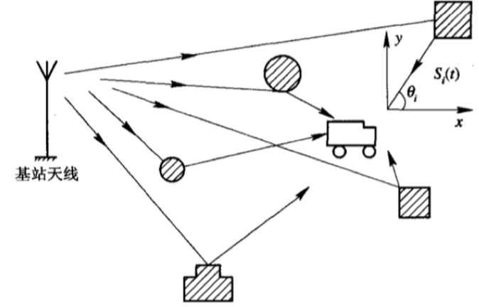
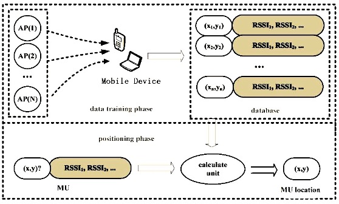
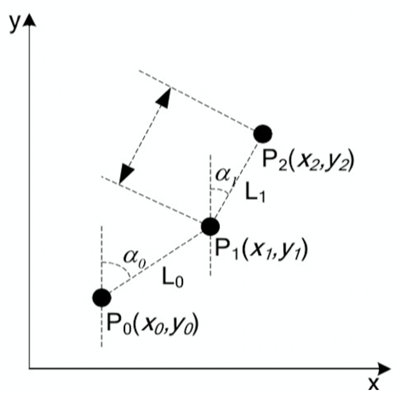
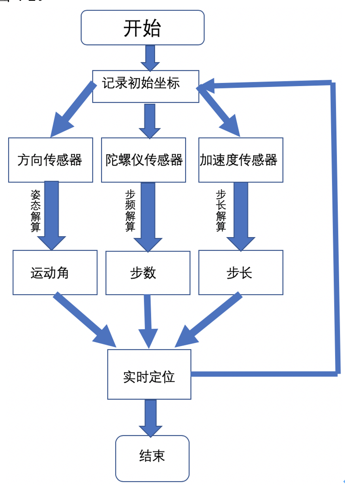
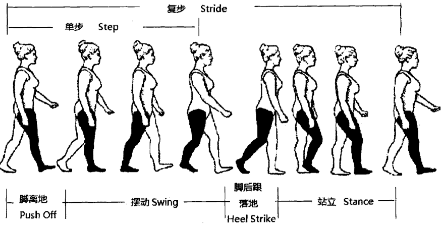
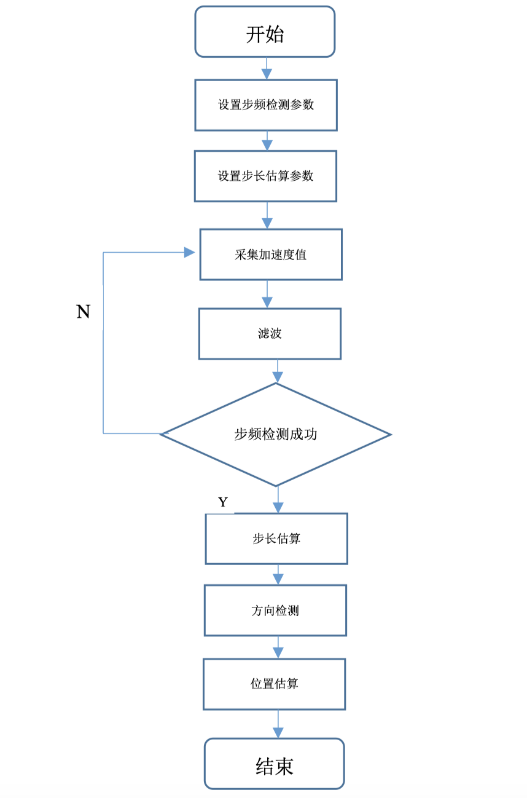
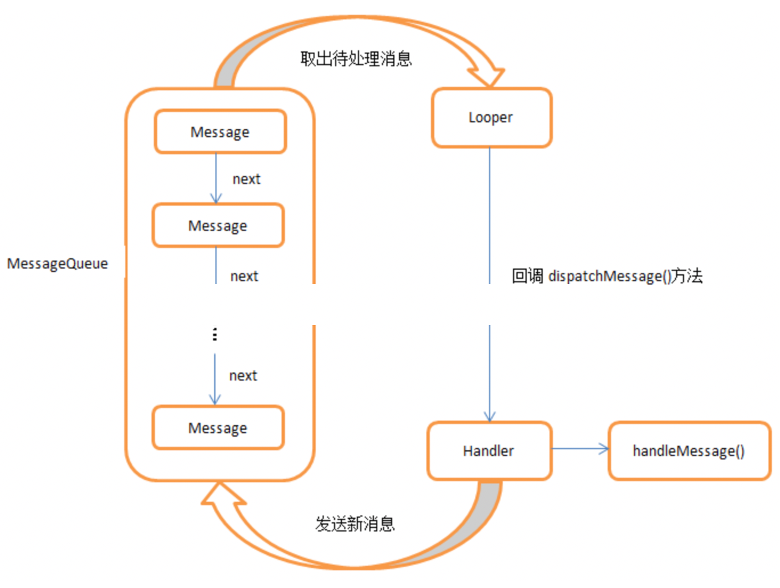
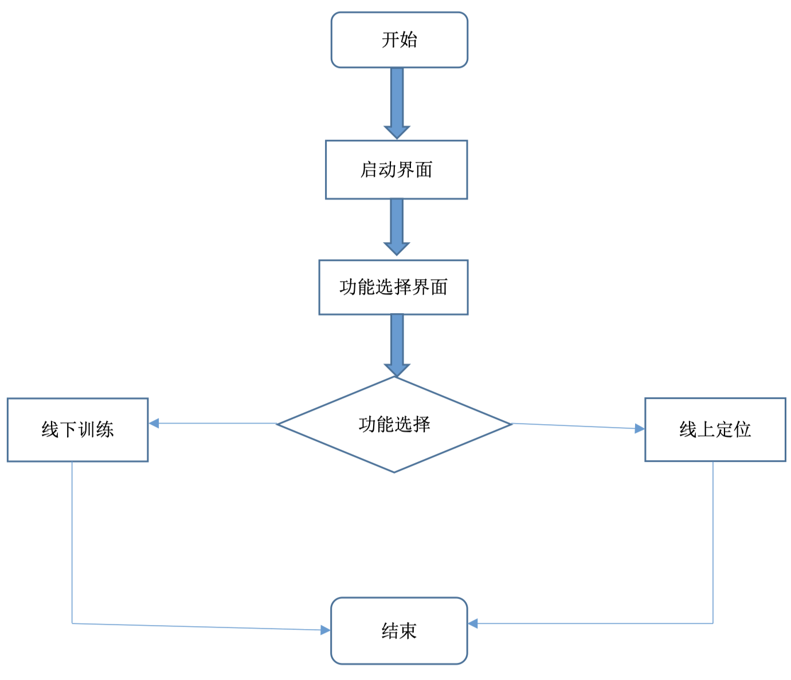
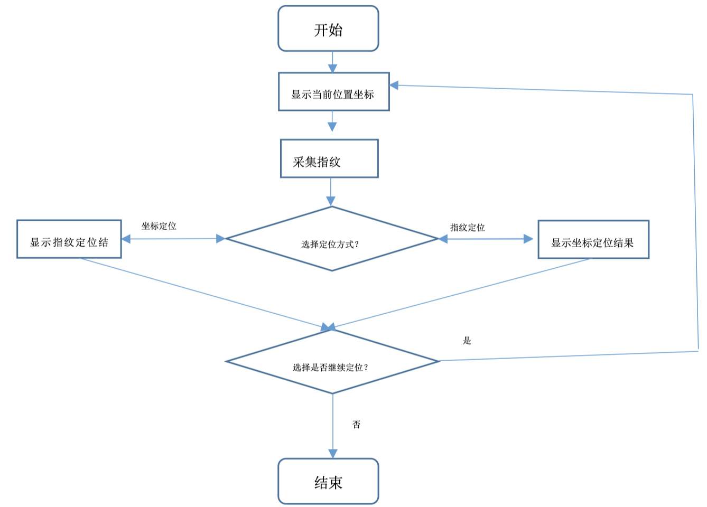

# MywifiLocation
<!-- TOC -->

- [1. **WiFi指纹定位原理**](#1-wifi指纹定位原理)
    - [1.1 指纹定位概念](#11-指纹定位概念)
        - [(1). 多径特征](#1-多径特征)
        - [(2). 接收信号强度(RSS)](#2-接收信号强度rss)
    - [1.2 WiFi位置指纹定位流程](#12-wifi位置指纹定位流程)
        - [(1)．线下训练阶段（data training phrase）](#1．线下训练阶段data-training-phrase)
        - [(2)．线上定位阶段（positioning phrase）](#2．线上定位阶段positioning-phrase)
    - [1. 3位置指纹匹配算法](#1-3位置指纹匹配算法)
        - [(1). **K最邻近算法（KNN)**](#1-k最邻近算法knn)
        - [(2)K加权近邻算法（KWNN）](#2k加权近邻算法kwnn)
- [2. 行人航迹推算定位技术的基本原理与实现](#2-行人航迹推算定位技术的基本原理与实现)
    - [2.1 PDR的算法原理](#21-pdr的算法原理)
    - [2.2 方向映射](#22-方向映射)
    - [2.3 数据过滤](#23-数据过滤)
    - [2.4 步态检测](#24-步态检测)
        - [(1) 行人步态特征](#1-行人步态特征)
        - [(2) 过零点检测](#2-过零点检测)
        - [(3) 波峰检测](#3-波峰检测)
    - [2.5 步长估计](#25-步长估计)
    - [2.6 PDR技术的应用](#26-pdr技术的应用)
- [3. Andriod应用程序的详细设计与实现](#3-andriod应用程序的详细设计与实现)
    - [3.1 应用程序实现功能](#31-应用程序实现功能)
    - [3.2 应用程序所使用的关键技术](#32-应用程序所使用的关键技术)
        - [(1) Android定时任务](#1-android定时任务)
        - [(2)SQLite数据库](#2sqlite数据库)
        - [(3) Andriod传感器](#3-andriod传感器)
        - [(4) 数据库设计](#4-数据库设计)
    - [3.3 应用程序功能模块设计](#33-应用程序功能模块设计)
        - [(1) 启动模块](#1-启动模块)
        - [(2) 线下训练模块](#2-线下训练模块)
        - [(3) 线上定位模块](#3-线上定位模块)
    - [3.4 应用程序界面流程设计](#34-应用程序界面流程设计)
        - [(1) 启动界面](#1-启动界面)
        - [(2) 线下训练界面](#2-线下训练界面)
        - [(3) 线上定位界面](#3-线上定位界面)
- [4. 待优化部分](#4-待优化部分)

<!-- /TOC -->
# 1. **WiFi指纹定位原理**

## 1.1 指纹定位概念

&emsp;&emsp;“位置指纹”这个概念就如同人类指纹一样：每个位置都有自己特有的指纹。 那么这个位置特征必须要有每个位置特有的特点。通常可以当作位置指纹的有：

### (1). 多径特征

&emsp;&emsp;在陆地移动通信中，因为无线信号都是载频比较大的并且存在各种 障碍物和其他移动体，所以无线信号会发生各种反射和折射，如图所示：

那么就可以看作是信号沿着不同信道传输，因此接收端会接收多个信号且每个信号的幅值 与时延都不同，这种现象就是多径效应。某个位置的多径特征是由该位置的实际环境 决定的，因此是个特有的特征，可以看作是位置指纹。

### (2). 接收信号强度(RSS)

&emsp;&emsp;RSS是最常用的信号特征。信号的RSS仅仅是取决于接收位置，这样就不需要信号要有较高的带宽。并且该信号特征在三边角测量定位被使用，根据信号传播损耗公式就能推算距离发送设备的距离。指纹定位的基本原理就是需定位设备通过将它采集的位置指纹发送到网络服务器，服务器对传送过来的信息进行处理估算，来匹配数据库中的指纹，最后确定设备的位置。这整个过程实际上是个模式识别的过程。

## 1.2 WiFi位置指纹定位流程

&emsp;&emsp;可以把整个WiFi位置指纹定位流程分为线下训练和线上定位两个阶段，已采集的指纹特征为信号强度RSS为例，如图所示：

现分别说明两个阶段所实现的内容。

### (1)．线下训练阶段（data training phrase） 

> 该阶段需完成指纹库的构建工作。从图中可以看出，位置指纹的结构为{（x,y）,rss1,rss2,…}，所以需要采集的信息有：位置点坐标和该位置的每个AP的RSS。基本流程是：先创建采集区域的坐标信息，一般都是以网格状划分区域；然后，在每个网格参考点采集该区域的坐标和每个AP点的信号强度，以指纹对的形式录入指纹数据库中；最后，重复以上步骤直到所有参考点的指纹信息。另外，为了区分所记录的RSS所属AP的类型还要记录每个WiFi的bssid。
需要注意的是使用该指纹结构的前提是指纹特征为RSS,如果选取其他指纹特征指纹结构也需变化。

### (2)．线上定位阶段（positioning phrase） 

> 该阶段需要实现移动设备的定位要求。在该阶段，处于定位区域的移动设备先采集各个AP的RSS，然后将采集到的数据上传到服务器，经过服务器用指纹匹配算法确定移动设备的位置。

## 1. 3位置指纹匹配算法

&emsp;&emsp;位置指纹匹配算法在线上定位阶段被使用，其性能好坏直接影响到定位准确率。位置指纹匹配算法可以分为概率型与确定型。概率型算法是计算待定位移动设备采集的每个AP点WiFi信号强度分布特征，并与指纹库中的数据进行匹配概率计算；确定型算法是计算待定位移动设备采集的N个AP点的N维RSS向量与指纹库的N维指纹向量距离，找出最近的指纹。其中定位阶段经常使用的是确定型匹配算法，下面介绍几种确定型算法：

### (1). **K最邻近算法（KNN)**

 &emsp;&emsp;该算法可以解释为：在一个有丰富的样本特征空间找到指定一个样本的类别 ，如果它的k个最相邻的样本大多数属于一个类别，则它也属于该类别。映射到位置指纹匹配方面，就是要找到关于未知指纹向量的K个最小距离向量其中大多数的所属类别，并且将这K指纹向量所对应坐标的均值视为未知指纹的坐标。该距离通常可以设为欧式距离。
计算未知指纹向量与指纹库中指纹向量的欧式距离公式为：

> $$ d(s,s_j)=\sqrt{\sum_{j=1}^n(s_i-s_{ij})^2} $$

其中，$s$为未知指纹向量，$n$为指纹向量维数，$s_j$为未知指纹向量第$j$个AP的RSS；$s_i$为指纹库中第i个指纹向量，$s_ij$为该指纹向量第j个AP的RSS。计算未知指纹位置坐标公式为：
> $$ (x,y)=\frac{1}{k}\sum_{i=1}^{k}(x_i,y_i)$$

其中，$(x,y)$为未知指纹对应坐标，$k$为最小近邻点个数，$(x_i,y_i)$为近邻点指纹坐标。

### (2)K加权近邻算法（KWNN） 

&emsp;&emsp;KWNN算法是对KNN算法的一种十分重要的改进：在记录平均坐标值时给每个指纹的坐标加上了一个权重系数，而该权重系数大小是与未知指纹和近邻指纹的欧氏距离成反比，这就实现了一种自适应功能。权重计算公式可以表示为：

>$$ w_i=\frac{\frac{1}{d(s,s_i)+\varepsilon}}{\sum_{j=1}^{k}\frac{1}{d(s,s_j)+\varepsilon}}$$

其中，$\varepsilon$是非常接近于0的正数，目的是当距离出现为0时分母不为0。计算未知指纹位置坐标公式为：
> $$ (x,y)=\frac{1}{k}\sum_{i=1}^{k}w_i(x_i,y_i) $$

# 2.行人航迹推算定位技术的基本原理与实现

&emsp;&emsp;在上一节介绍WiFi指纹定位技术时提到，构建一个位置的指纹不仅需要该点的RSS而且需要知道该点的坐标。所以这部分介绍通过行人航迹推算定位技术(Pedestrian Dead Reckoning,PDR)来计算每一个位置的坐标。

>行人航迹推算算法（PDR）是由航迹推算（DR）算法逐渐演变而来。在中世纪的航海时代有着定位商贸船的需求，所以这种定位技术才逐渐发展起来。航迹推算算法的基本原理就是已知当前船只的初试坐标，再知道船只的航行方向、航行角度和航行距离，在由公式   
>$$\begin{cases}
x_1 =x_0+L_0\cos(\alpha) \\y_1=y_0+L_0\sin(\alpha)\end{cases}$$
>就能计算船只接下来的运动位置坐标。

但是现在，仅仅是定位船只位置显然是不够的。因为现在人们室内活动明显增多，所以人们需要了解其在建筑物中的位置。例如消防员在救援工作中需要了解其在建筑物中的位置时，室内定位就变得很重要。 室内定位的替代方法是行人航位推算（PDR）。

以下首先介绍PDR技术的算法原理，再介绍PDR技术用到的几种重要的处理步骤。

## 2.1 PDR的算法原理
&emsp;&emsp;行人航迹推算（PDR）是一种行人定位解决方案，通过将估计的位移添加到起始已知位置来确定行人的最新位置。位移用步长表示，但不同人或者同一人的不同步步长都不完全相同。所以要通过加速度传感器完成步长的检测和估计并估计位移来确认行人的移动距离。因为PDR技术的关键是获取行人的步态特征，通过已知的初始位置、运动加速度传感器的各个方向加速度的变化、移动方向步长来推算行人下个位置坐标，所以对惯性传感器的需要求并不明显。考虑到这个方面，一般的智能手机或其他智能设备都能实现PDR定位。PDR技术定位步骤如下:

>* 步骤一：需确定行人的初始位置坐标；
>* 步骤二：根据智能手机的方向传感器确定运动方向和角度；
>* 步骤三：通过智能手机的陀螺仪传感器，执行步态分析并记录运动步数；
>* 步骤四：通过智能手机加速度传感器的数据再结合步态分析，确认运动步长；
>* 步骤五：通过已知的步长、步数、运动方向和初始位置坐标结合公式就能确定当前行人位置。
>详细流程请见图所示

## 2.2  方向映射

&emsp;&emsp;为了解决智能手机任意角度放置的为题，需要进行方向映射。具体做法是：智能手机加速度传感器能够显示三个坐标轴方向的加速度，因此可以将局部坐标系映射到世界坐标系，这样做是为了使用磁性传感器获取导航坐标系统的加速度值。

## 2.3 数据过滤

&emsp;&emsp;必须要对加速度信号进行滤波处理以获取所需的输出信号：无重力和无噪声信号。重力加速度是一种低频信号分量，会引起y轴上的偏移，约为9.8m /s²。为了消除重力加速度的影响，使用高通滤波对信号进行滤波，该滤波通过公式实现。
>$$\begin{cases}accl_{avg}=accl*0.1+accl_{avg}*0.9
\\accl_{hpfiltered}=accl-accl_{avg}  \end{cases}$$
其中，$accl_{avg}$为开始处理前，智能手机保持静止状态下采集多次的加速度的均值；$accl_{hpfiltered}$为重力加速度。通过减去用波形平均值表示的低频信号分量，以去除直流分量。 然后，通过低通滤波处理高通滤波的输出，以平滑信号并减少随机噪声。 通过使用移动平均滤波器作为公式（4-，可以完成低通滤波。
>$$	y[i]=\frac{1}{M}\sum_{j=-(M-1)/2}^{(M-1)/2}x[i-j]

其中$y[]$和$x[]$分别是经过平均滤波的输出和未经滤波的输入信号。M是移动窗口，在移动平均值中使用的点数，这里M通常取5。

## 2.4 步态检测

&emsp;&emsp;行人的行进距离由他的脚步代表。因此，有必要准确地检测出步态变化以获得更好的估计。 有两种常见的步态检测方法可用于分析加速度信号：峰值检测和过零检测。

### (1) 行人步态特征
行走对于人类来说是个机械化的重复过程，并且对于信号检测来说，个人的行走方式没有太大影响，都是信号大小在某个加速度方向进行变化，更重要的是信号的变化是呈周期性的。由此，如果确定了该变化的特点那么就能计算出行人的步态和步长。
通过其他研究者的研究数据发现，行人行走的规律和特征具体如下：
 >* 特征1：行人行进的每一步都是周期重复性的过程。该过程具体可以拆成以下几个阶段：先是，其中一只脚抬起、下肢发力摆动，这时上肢的运动趋势为向上；随后，抬起的脚脚后跟着地，这是上肢的运动趋势为向下并且整个肢体的前进加速度减小。该过程重复两次就完成了一个周期，被称为复步。图4-3为具体的步态分析过程；
>* 特征2：步频稳定。步频就是行人在单位时间能完成的行走步数，一个正常人的步频平均在90到130步/分之间。但是有时还需考虑具体个体的运动状态或运动水平的影响；
>* 特征3：当行人的步频稳定不变时，他的步长几乎不会发生变化；
>* 特征4：在行走过程中，各个方向加速度的大小变化都是呈周期性的变化。

### (2) 过零点检测
&emsp;&emsp;过零方法对信号越过零电平进行计数以确定步态变化的出现。研究人员通常使用时间间隔阈值来拒绝错误的步长检测。此方法通常不适用于检测用户的步态，因为它需要一定的时间间隔阈值才能确定过零是否代表有效步态。当某些对象的脚步之间的时间间隔发生变化时用这种方法会发生一些问题，因此想使用过零方法并不进行校准过程来准确检测步态变化是非常困难的。

### (3) 波峰检测
波峰检测算法是目前最常用的步态检测算法，它具有计算量小且模型并不复杂等优点。由于脚踩在地面上时垂直加速度是由垂直冲击产生的，因此垂直加速度的峰值对应于步态变化的出现。当然，垂直方向加速度变化也是周期性的，具体变化如图所示：

波峰检测算法可以看作是一种相对阈值的检测方案，当在一定时间间隔内依次检测到有效最大峰值（作为最大值）和有效最小峰值（作为最小值）时，此方案将检测到一个步态变换。 最大值是超过上限的最大峰值，最小值是低于下限的最小峰值。该算法的具体流程如下：
>* 步骤1：需要在当前滑动窗口中找到峰值；
>* 步骤2：规定好加速度的阈值，通过峰值是否超过阈值来找出伪峰；
>* 步骤3：规定好时间的阈值，通过两个峰之间的时间差是否超过阈值来找出伪峰；
>* 步骤4：通过左右相邻的加速度阈值里的峰值是否比当前检测到的峰值大来找出伪峰；
>* 步骤5：通过以上步骤判断出不是伪峰，则就算有效的步态变化

## 2.5 步长估计

&emsp;&emsp;可以通过估计每个有效检测步态变化中的步长来计算总行驶距离。通常，有两种估算步长的方法：静态方法和动态方法。静态方法假定具有相同长度的任何有效步态都可以通过公式确定。
$$ stepsize=height*K $$
对于男性k的大小为0.415，对于女性为0.413。
与静态方法相反，动态方法假定具有有效步态的有效步长可以使用某些方法进行估算，例如：

>* Weinberg方法  
假设由于步行活动的影响而发生的垂直跳动与步长成正比[9]。 使用每一步的峰峰值的差异作为方程式来计算垂直反弹:  
>$$ stepsize=K\sqrt[4]{(a_{max}-a_{mim})}$$  
>&emsp;&emsp;K值对所有人都是0.410。
>* Scarlet方法  
试图解决由弹跳在不同的人的步调中变化，或一个人从一个测量到另一个测量的步调不同而导致的步长变化引起的精度问题。该方法提供了一种简单的解决方案，该解决方案显示了步长的最大值，最小值和平均加速度之间的相关性，如公式（4.6）所示
>$$ stepsize=k*\frac{\frac{\sum_{k=1}^{N} \left\vert a \right\vert}{N}-a_{min}}{a_{max}-a_{min}} $$
>&emsp;&emsp;K值对所有人都是0.810。
>* Kim方法   
提出了一个等式，该等式表示在不同步态之间步长和平均加速度之间的关系。由于传感器的位置不同，K值常被修改。  
>$$stepsize=k*\sqrt[3]{\frac{\sum_{k=1}^{N}\left\vert a \right\vert}{N}}$$
>&emsp;&emsp;其中，K值设为0.550。

## 2.6 PDR技术的应用

&emsp;&emsp;在移动智能终端上实现PDR技术定位流程，如图所示：

# 3. Andriod应用程序的详细设计与实现

## 3.1 应用程序实现功能

&emsp;&emsp;该项目设计的安卓应用程序可实现：
* WiFi指纹指纹库自动构建；
* 利用指纹库的指纹数据实现未知位置的安卓手机定位；
* 利用安卓传感器与PDR技术实现行人运动坐标获取。

## 3.2 应用程序所使用的关键技术

### (1) Android定时任务

在设计程序定时采集Ap的RSS时会用到该功能。为了充分理解Andriod定时任务机制，首先要知道Andriod怎样进行消息处理的，具体流程如下图所示：

### (2)SQLite数据库

&emsp;&emsp;在Andriod的系统运行库层内置了SQLite数据库，它处于C/C++库中。SQLite数据库是一种轻量级的关系数据库，它具有运行速度快、占用资源少等优点，所以目前移动设备经常使用它来存储数据。而且可以使用SQL语句对数据库进行增删查改的操作，SQLite的事务属性也是标准的ACID事务。

&emsp;&emsp;LitePal是GitHub上的一个十分优秀的开源项目，作为一种数据库框架能够简化SQL语句极大提高了数据库开发的效率。并且LitePal采用了对象关系的映射模式，集成了常用的数据库的功能。LitePal的特征如下

* 特征1：使用对象关系映射模式(ORM);
* 特征2：配置简单；
* 特征3：维护数据表的操作为自动；
* 特征4：不仅支持SQLite数据库，还支持其他各种数据库；
* 特征5：包含无需编写SQL语句声明的应用程序接口（API）；
* 特征6：查询API速度很快。
  
### (3) Andriod传感器

&emsp; &emsp;当我们想知道自己的andriod智能手机的运动情况包括：手机倾斜角度、运动方向等，又或者想知道手机周围环境的情况包括：温度和气压等，都可以从andriod手机内置的传感器获得。我们手机常用的天气与罗盘等应用程序都是通过这些传感器实现的。Andriod平台支持的传感器类型可以分为三类：

* 运动传感器：这类传感器可以获得手机在三个坐标轴上的加速度大小与方向，以及旋转力。因为这类传感器包含了加速度传感器、重力传感器和陀螺仪；
*  环境传感器：通过这类传感器可以获得周围的环境信息。因为这类传感器包含温度传感器、气压传感器等；
* 位置传感器：主要负责测量智能设备的物理位置变化。
  
### (4) 数据库设计

&emsp;&emsp;设计的应用程序用到了以下实体：指纹点和坐标点。所以在LitePal里创建了两张数据表。

指纹点数据结构表：

|数据名称 |变量名|数据类型 |
|:----:|:-----:|:----:|
|指纹id|	id|	integer|
|X轴坐标|	x	|double|
|Y轴坐标|	y|	double|
|接入点1的平均RSS|	ap1	|integer|
|接入点2的平均RSS|	ap2	|integer|
|接入点3的平均RSS|	ap3|	integer|
|指纹名	|type|	String|

坐标点数据结构表：
|数据名称|	变量名|	数据类型|
|:----:|:-----:|:----:|
坐标id	|id	|integer
X轴坐标|	x|	double
Y轴坐标|	y|	double
坐标点名称|	type|	String

## 3.3 应用程序功能模块设计

该应用程序包含两个子模块，一个是线下训练模块，实现指纹库的自动构建；另一个是线上定位模块，实现指纹定位与PDR技术定位。
应用程序总体流程如下所示：

### (1) 启动模块

该界面主要完成应用程序功能模块的选择。

### (2) 线下训练模块

&emsp;&emsp;该模块要完成位置指纹采集和利用PDR技术确定位置坐标功能。在线下训练阶段界面可以设置位置指纹名，这是为了在定位阶段确定手机位置时不仅能够显示位置坐标还能显示位置名称；该模块具有事件监听功能，一旦智能手机位置发生变化利用PDR技术可以实时显示当前位置坐标；该模块还具有自动采集Ap点的RSS功能，并最终把指纹数据存储到SQLite数据库中。

### (3) 线上定位模块

&emsp;&emsp;该功能模块需完成指纹定位和PDR技术定位功能。该模块也应该具有事件监听功能，监听传感器数据的变化，并利用PDR技术显示当前智能手机位置坐标；该模块还应该具有自动采集未知位置指纹的功能，为了进行指纹定位；该模块最终需完成定位功能，利用KNN算法计算出指纹定位结果和坐标定位结果，不仅显示当前位置坐标还显示位置名称。

## 3.4 应用程序界面流程设计

### (1) 启动界面
&emsp;&emsp;该界面设置两个button，并且这两个button都注册了事件监听：点击button1会跳转到线下训练模块界面，点击button2会跳转到线上定位界面。

### (2) 线下训练界面

&emsp;&emsp;该界面流程如图所示：

&emsp;&emsp;具体步骤如下：

* 步骤1：在线下定位界面会自动把当前坐标显示在座标文本框中；
* 步骤2：需要在指纹名文本框中编辑当前位置名称，也就是指纹名称；
* 步骤3：采集多个Ap的平均RSS。该采集过程为自动，同时也可以手动结束采集；
* 步骤4：将采集的位置指纹存入指纹数据库；
* 步骤5：选择结束指纹采集的话，界面会自动跳转到功能选择界面；选择继续采集下个位置指纹，则通过PDR技术和andriod传感器当前位置坐标发生变化，同时跳到步骤1。

### (3) 线上定位界面

&emsp;&emsp;该界面流程如图所示：

&emsp;&emsp;具体流程如下：

* 步骤1：在线上训练界面利用PDR技术和andriod传感器自动显示当前位置坐标；
* 步骤2：采集当前位置的Ap的平均RSS；
* 步骤3：选择定位方式。总共有指纹定位和坐标定位两种不同的定位方式，采用不同的定位方式给出各自的结果；
* 步骤4：选择是否继续定位下个位置。选择是，跳转到步骤1，利用PDR技术和andriod传感器更新当前位置坐标；选择否，跳转到功能选择界面

# 4.  待优化部分

* 应用程序界面设计的并不美观和操作逻辑还能进一步优化。
* 该应用程序在训练阶段将数据录入指纹库时需要手动，这里可以进一步改进为：当前位置指纹信息采集完时自动存入数据库。并且，该应用程序不能实现采集三个以上ap的RSS信息，这点也需改进。
* 该应用程序在长时间运行后，会存在进程被手机杀死的情况。这个可以通过使用后台服务的功能进行优化。
* 这里用的数据库是andriod系统自带的本地数据库，但为了可以进行网络定位，后续需要把数据库部署在云端服务器上。

